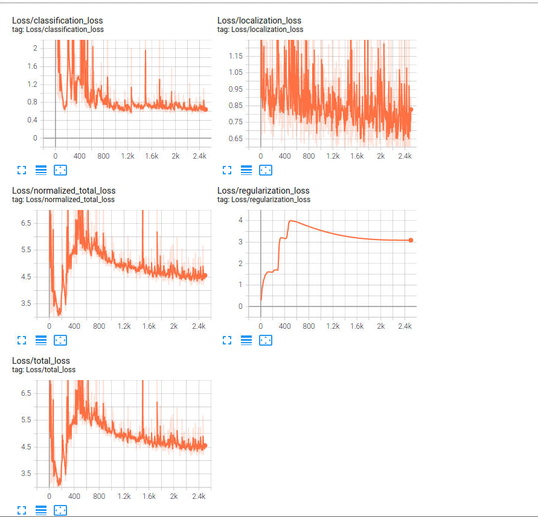
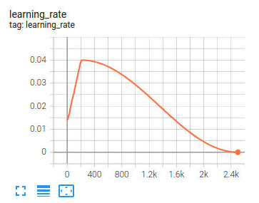
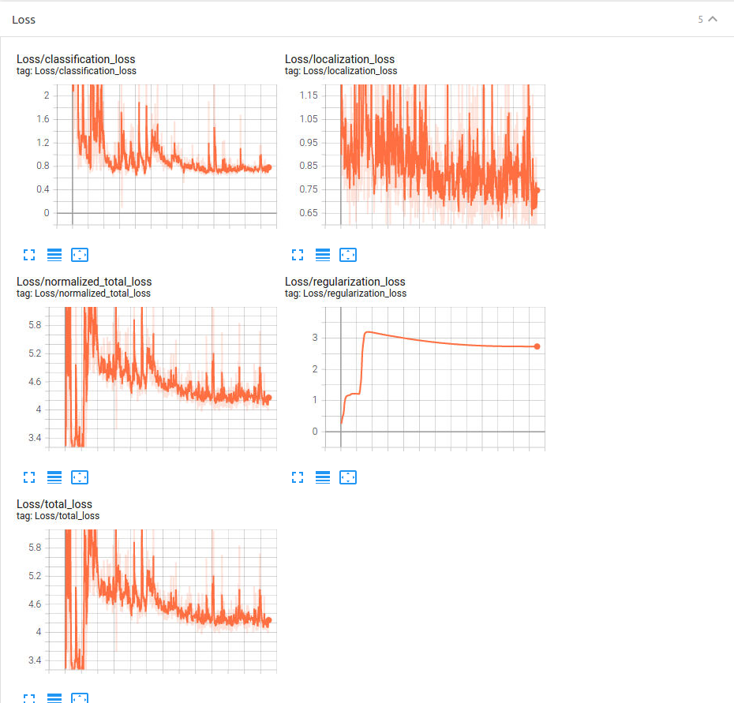
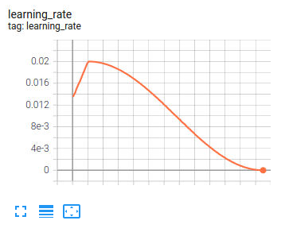

# Object Detection in an Urban Environment

In this project the Object Detection algorithm with Computer Vision are implemented

## Step 1: Exploratory Data Analysis
With the Jupyter Notebook the Exploratory Data Analysis is mate.
- A function is implemented to display the image and save them which showcases the bounding boxes
- A simple analysis of the images are made.

The images from the data/val/ folder is used to perform this

From the data images the following images are obtained (few samples are given here)

Apart from plotting the bboxes, an analysis of the images are made
1. How many class objects were present on the 1000 images chosen
2. How many images have the particular classes in them

## Step 2: Edit the Config File
With the given script the new config file was generated.

## Step 3: Model Training and Evaluation
A training is done on the reference model and the Tensor flow plots are logged. THe experiment is run for about 2500 steps. The learning rate reaches its max at 212. This may be due to the skewed dataset, which contains very low number of cyclists which makes the model underfit for detecting cyclists. The model is also over fit for vehicles. 

## Step 4: Improve the Performance
On the new traiining config file, it was noted that only simpler image augmentation was available. So the following augmentation were added on the new training
- random_black_pathes
- random_rgb_to_gray
- random_adjust_brightness
- random_adjust_contrast
- random_adjust_saturation
- random_adjust_hue
- random_image_scale
- random_distort_color

## Step 5: Creating animations
WIth the improved model the following animations are made
