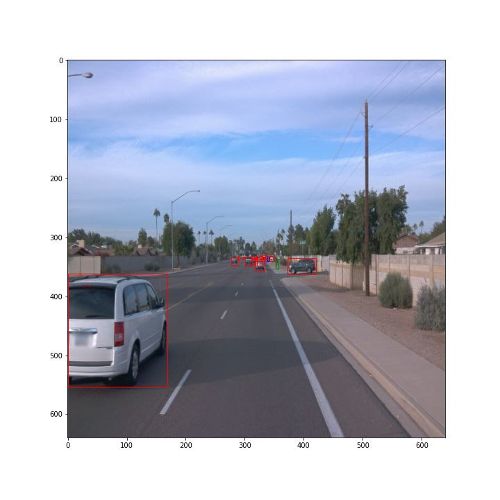
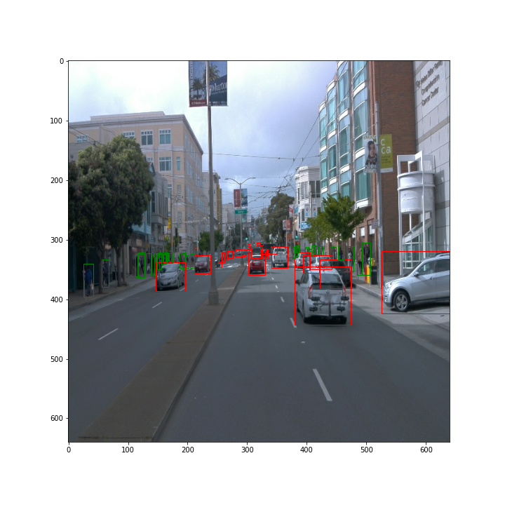
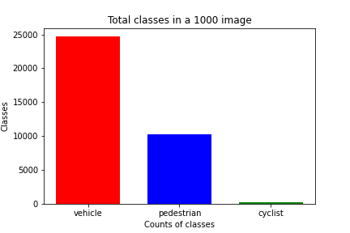
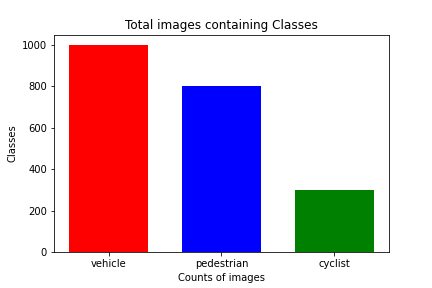

# Object Detection in an Urban Environment

In this project the Object Detection algorithm with Computer Vision are implemented

## Step 1: Exploratory Data Analysis
With the Jupyter Notebook the Exploratory Data Analysis is mate.
- A function is implemented to display the image and save them which showcases the bounding boxes
- A simple analysis of the images are made.

The images from the data/val/ folder is used to perform this

From the data images the following images are obtained (few samples are given here)

Apart from plotting the bboxes, an analysis of the images are made
1. How many class objects were present on the 1000 images chosen
2. How many images have the particular classes in them

